# Agent Present

**A presentation layer for AI agents. Don't make me read.**

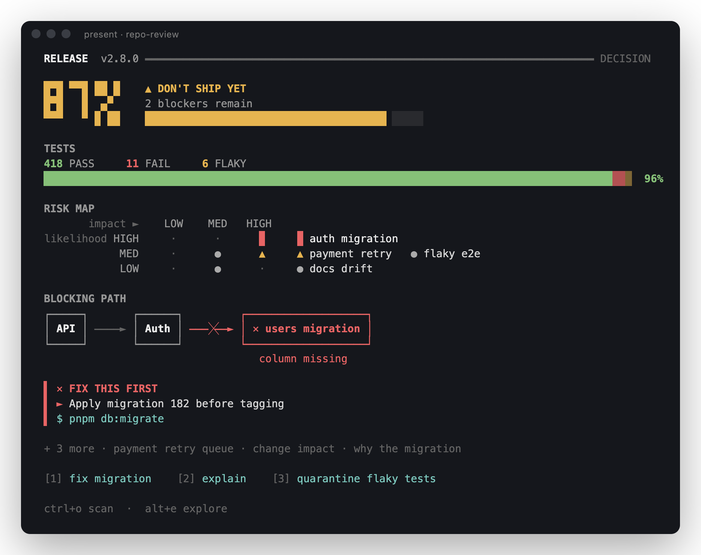

> AI did four minutes of work.
> Why am I reading 1,800 words to understand it?

Agents have become dramatically better at *doing* work. They have not become better at *presenting* it. A coding agent inspects 80 files, runs the tests, reasons for minutes — and then hands you "Here are my findings…" followed by a wall of Markdown.

Agent Present lets an agent answer with **visual information structures instead of prose**: a verdict that looks like a verdict, a comparison that looks like a comparison, a risk that looks risky, a causal chain you can follow with your eyes. You get the important part in five to ten seconds, then choose whether to explore further.

> **If information has structure, show the structure. Don't describe it.**

It ships as an open specification (the **Present spec**), a responsive terminal renderer, a native extension for the [Pi](https://pi.dev) coding agent, and a mod for [Claude Code](#install-claude-code).

## Before / after

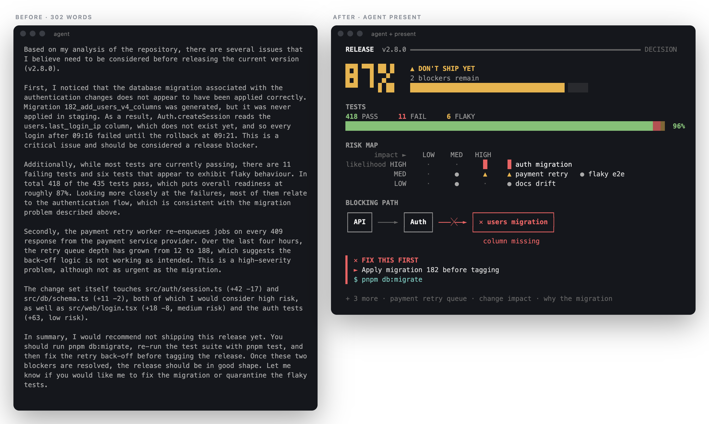

The same facts. The conventional answer is 300 words; the glance view has a single line of prose, and the details are still one keystroke away. That comparison is the project.

<details><summary>More before / after</summary>

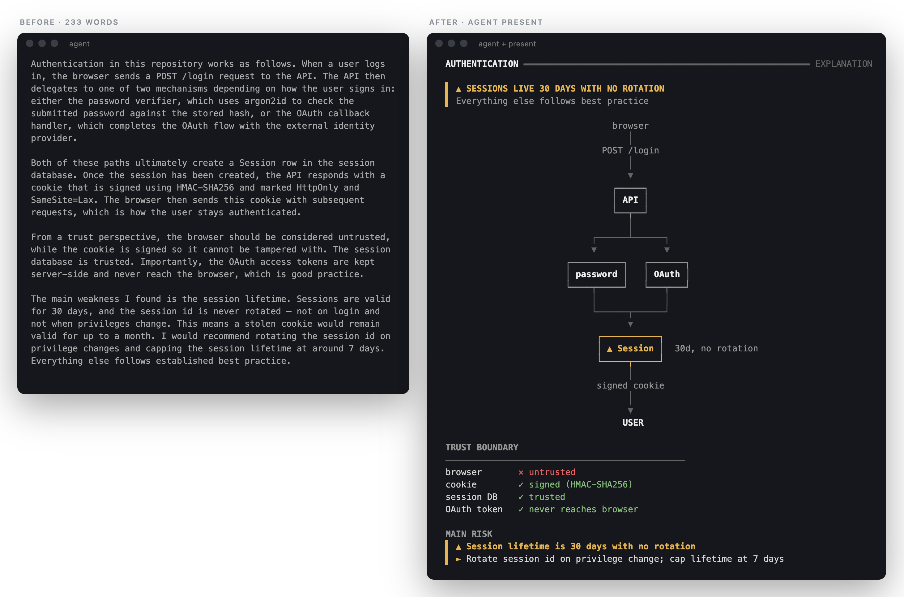
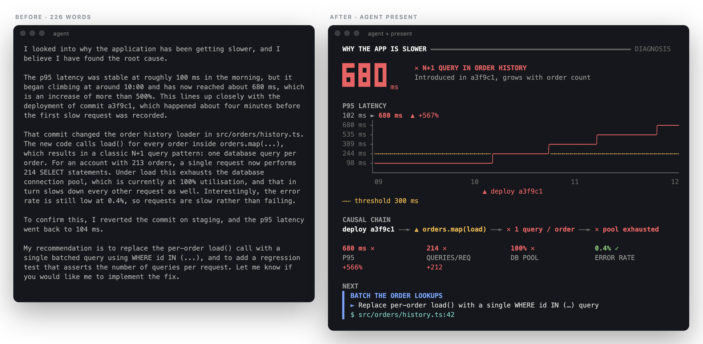

</details>

## Install (Pi)

```bash
pi install npm:@agent-present/pi
```

That's it. [](https://www.npmjs.com/package/@agent-present/pi)

To try it for one session without installing:

```bash
pi -e npm:@agent-present/pi
```

Or install straight from GitHub to track `main`:

```bash
pi install git:github.com/sjespersen/agent-present
```

Then just work. When an answer has structure, the agent calls the `present` tool and the result renders natively in the transcript. No configuration. Type `/present demo` to see the showcases without spending a token.

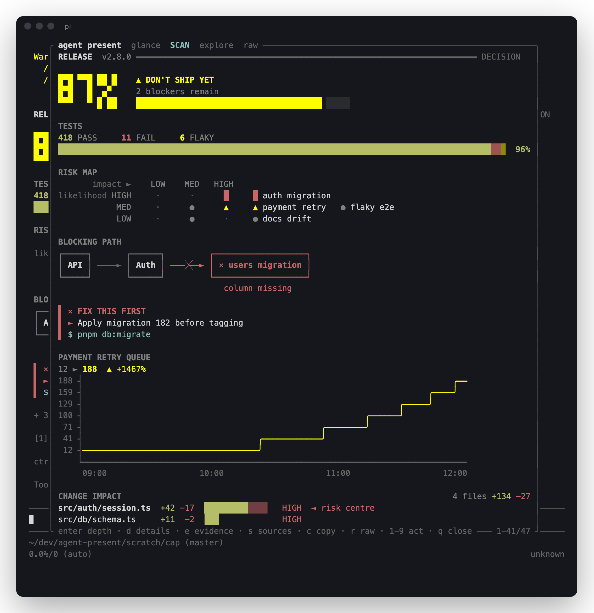

### Glance → Scan → Explore

| depth | time | how |
|---|---|---|
| **Glance** | 5–10 s | Default view: the takeaway, at most five visual blocks, actions. |
| **Scan** | ~30 s | `ctrl+o` (Pi's expand key) adds the secondary blocks. |
| **Explore** | as long as you like | `alt+e` opens the explorer: full detail, evidence, sources, raw IR. |

Explorer keys: `enter` cycle depth · `d` details · `e` evidence · `s` sources · `c` copy as text · `r` raw document · `1–9` run an action · `↑↓ pgup pgdn g G` scroll · `q` close.

### Commands

| command | |
|---|---|
| `/present auto` (or `on`) | The agent presents when structure helps. Default. |
| `/present always` | Every substantive answer becomes a presentation. |
| `/present off` | Disable the tool; plain text only. |
| `/present last` | **Compatibility mode:** convert the previous plain-text answer into a presentation with one model call. Adoption doesn't require changing your agent. |
| `/present demo [name\|all]` | Show the showcases: `repo-review`, `architecture`, `comparison`, `debugging`, `research`, `timeline`, `progress`. |
| `/present view` · `/present raw` | Open the explorer (on the raw IR). |
| `/present act <n>` | Run action *n* of the last presentation, e.g. send "Fix the migration" back to the agent. |

Modes persist per session.

<details><summary>Compatibility mode, live: a 200-word prose answer about HTTP caching, converted by <code>/present last</code></summary>

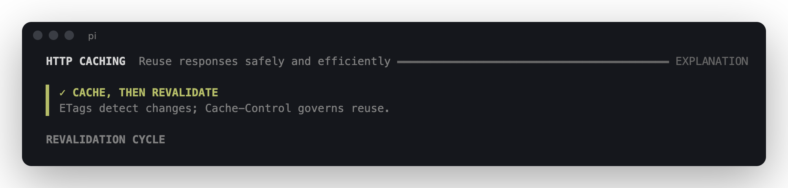

</details>

### No duplicate answers

The worst failure mode is a beautiful graphic followed by the same content again in 800 words. Agent Present prevents it structurally, not just by asking nicely: the `present` tool **ends the agent's turn** (Pi's `terminate`), the tool result tells the model the user has already seen it, and the prompt guidelines say a presentation *is* the answer. Long explanations go into `detail.markdown`, behind `alt+e`.

The agent still answers trivial questions in plain text. *"What's the command to list Git branches?"* gets `git branch`, not an infographic.

### Work in progress

A `present` call with `intent: "progress"` does not end the turn. It shows a live status widget above the editor that disappears when the final presentation arrives.

## Install (Claude Code)

This repository is a Claude Code plugin marketplace:

```bash
claude plugin marketplace add sjespersen/agent-present
claude plugin install agent-present@agent-present
```

Restart Claude Code, then type `/present demo all` to see the showcases without spending a token. `claude plugin update agent-present@agent-present` picks up new versions.

To try it for one session without installing, load the [plugin folder](packages/claude-code) directly. The bundle is committed, so there is nothing to build:

```bash
git clone https://github.com/sjespersen/agent-present && cd agent-present
claude --plugin-dir packages/claude-code
```

It behaves like the Pi extension:

- **The presentation is drawn in place of the tool's row** in the transcript, in your Claude Code theme's colours. The model's copy of the result stays out of sight.
- **No duplicate answers.** A final presentation ends the turn: the model request that would follow it is never sent.
- **Actions.** After a presentation, a band above the prompt offers its actions as buttons (`ctrl+x tab` to focus it, then a digit). `/present act <n>` runs them too.
- **Explorer.** `/present view` opens a pane: `g` `s` `x` switch between glance, scan and explore, `r` shows the raw document, `c` copies the presentation as text, `1–9` run an action, and `esc` closes it.
- **Progress.** A `progress` call shows a live band above the prompt while Claude keeps working.
- **Headless.** In `claude -p`, the answer is the presentation rendered as plain text.

`/present` takes the same subcommands as in Pi: `auto`, `always`, `off`, `last`, `demo`, `view`, `raw` and `act`. See the [mod's README](packages/claude-code/README.md) for details.

## Gallery

| | |
|---|---|
|  | 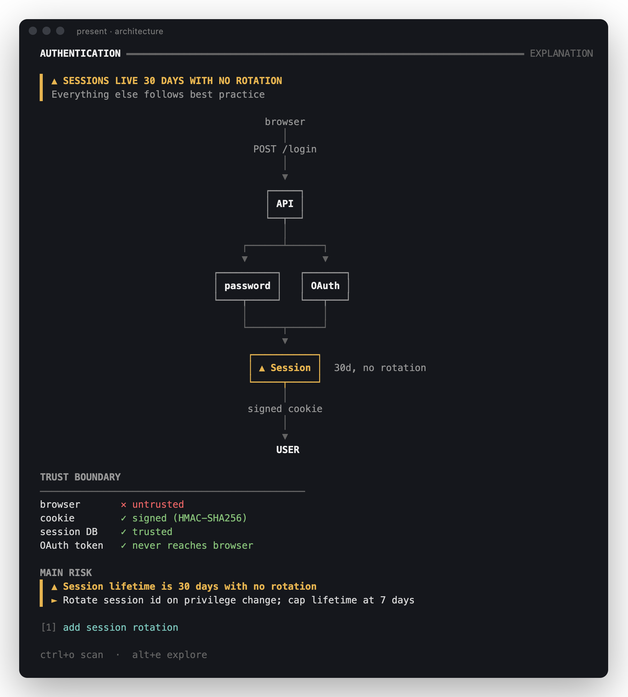 |
| **Repository review** — verdict, test split, risk map, blocking path | **Architecture** — the diagram is the explanation |
| 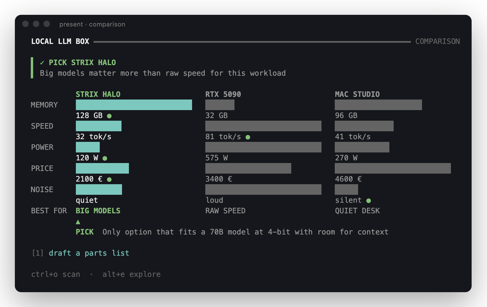 | 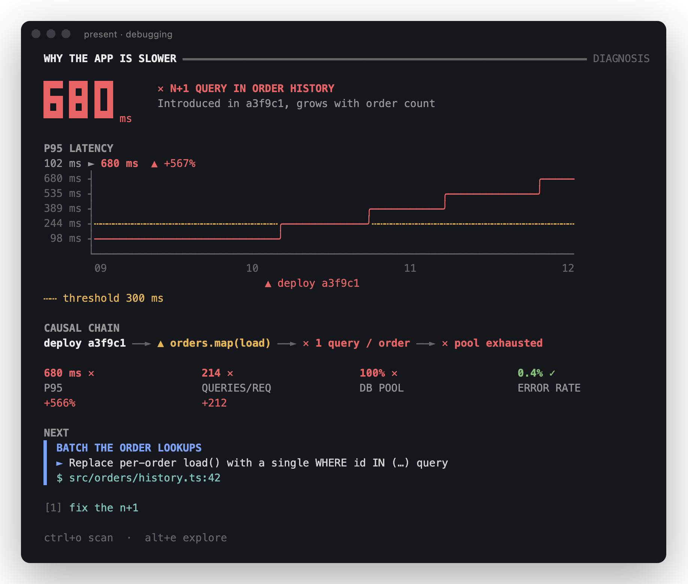 |
| **Comparison** — trade-offs and a pick, not a Markdown table | **Debugging** — trend, causal chain, metrics, next step |
| 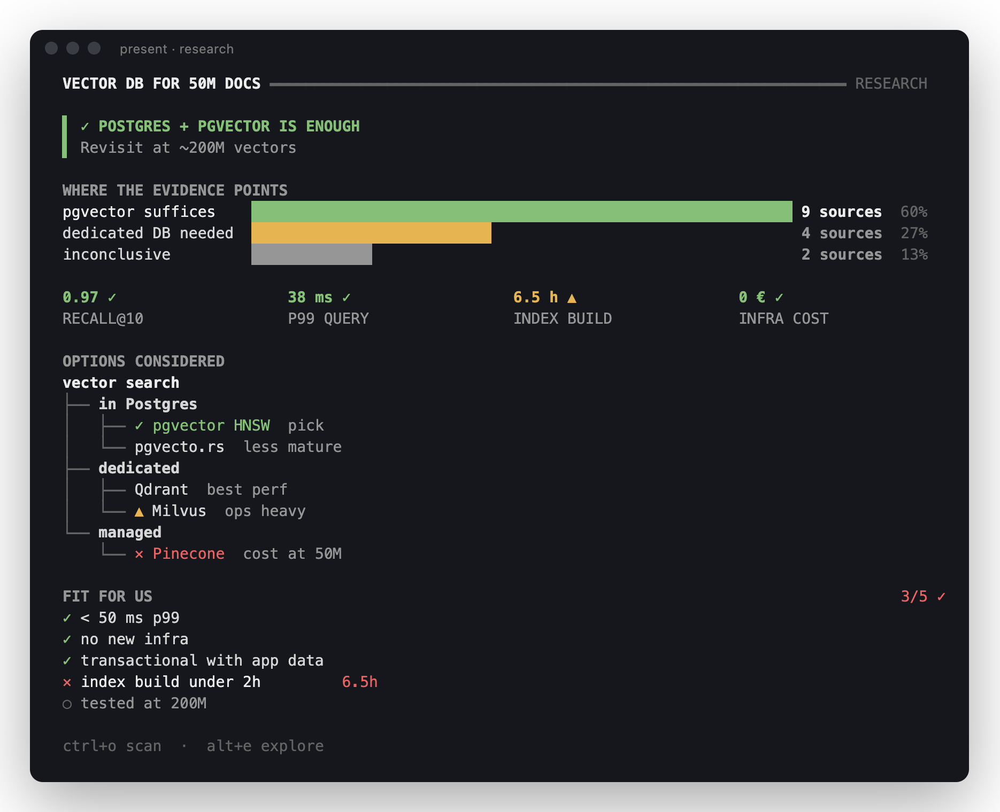 | 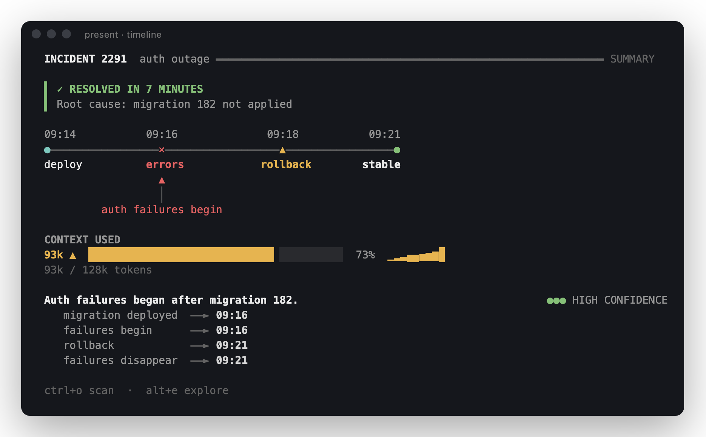 |
| **Research synthesis** — evidence weight, options tree, fit checklist | **Incident** — timeline, metric, evidence |

**Responsive, not truncated.** The same document at [60 columns](gallery/repo-review-narrow.png) stacks vertically; at [150 columns](gallery/repo-review-wide.png) blocks sit side by side. It also renders in [pure ASCII](gallery/repo-review-ascii.png) and stays readable in monochrome, because every status has a glyph as well as a colour. Plain-text renders of every example are in [`gallery/text/`](gallery/text/).

## Why another standard?

There are good protocols for agents and interfaces already. None of them describes *information*.

```
AG-UI         "How does the agent communicate with the frontend?"
A2UI          "What UI components should the frontend render?"
PRESENT SPEC  "How should this INFORMATION be communicated to a human?"
```

[AG-UI](https://github.com/ag-ui-protocol/ag-ui) is an event transport; a Present document can travel over it. [A2UI](https://github.com/google/A2UI) describes components from a trusted catalogue; Present documents could compile into it. The Present spec sits one level higher. The agent says what something *means* — this is a comparison, this option wins, this edge is broken — and each renderer decides how that looks on a terminal, a web page, or in a voice briefing.

```json
{ "type": "comparison", "winner": "strix", "options": [], "dimensions": [] }
```

not

```json
{ "type": "row", "children": [{ "type": "box", "width": 42 }] }
```

## The Present spec

A Present document is a takeaway, a handful of semantic blocks, optional actions, and detail for later:

```json
{
  "present": "0.1",
  "title": "Release",
  "subtitle": "v2.8.0",
  "intent": "decision",
  "takeaway": { "status": "warning", "text": "Don't ship yet", "detail": "2 blockers remain", "value": 87, "unit": "%" },
  "blocks": [
    { "type": "distribution", "title": "Tests", "whole": true, "items": [
      { "label": "pass", "value": 418, "status": "good" },
      { "label": "fail", "value": 11, "status": "critical" },
      { "label": "flaky", "value": 6, "status": "warning" } ] },
    { "type": "flow", "title": "Blocking path",
      "nodes": [{ "id": "api", "label": "API" }, { "id": "auth", "label": "Auth" },
                { "id": "mig", "label": "users migration", "status": "critical", "note": "column missing" }],
      "edges": [{ "from": "api", "to": "auth" }, { "from": "auth", "to": "mig", "status": "critical" }] }
  ],
  "actions": [{ "id": "fix", "label": "Fix migration", "intent": "agent", "prompt": "Fix the users migration." }],
  "detail": { "markdown": "The long explanation lives here, one keystroke away." }
}
```

Sixteen primitives in v0.1: `verdict` `metric` `metrics` `comparison` `flow` `architecture` `timeline` `trend` `distribution` `risk` `hierarchy` `checklist` `evidence` `change` `progress` `text`.

**→ [Read the specification](specification/README.md)** · [JSON Schema](specification/present.schema.json) · [primitive reference with renders](specification/primitives/INDEX.md) · [canonical examples](examples/)

## Render anywhere

The terminal renderer works without Pi. Its `present-render` command renders any Present document:

```bash
npx -p @agent-present/terminal present-render doc.json                  # glance
npx -p @agent-present/terminal present-render doc.json --depth scan
cat doc.json | npx -p @agent-present/terminal present-render --width 80 --ascii
npx -p @agent-present/terminal present-render doc.json --validate
```

The [`examples/`](examples/) folder has documents to try. Or use it as a library:

```bash
npm install @agent-present/core @agent-present/terminal
```

```ts
import { validate } from "@agent-present/core";
import { renderDocument } from "@agent-present/terminal";

const { valid, errors } = validate(doc);
console.log(renderDocument(doc, { width: process.stdout.columns, depth: "glance" }).join("\n"));
```

## Build your own renderer

The Present spec is meant to have many renderers: web, mobile, voice, SVG. `@agent-present/core` gives you the parts that are not about pixels:

- `validate(doc)` checks against the schema and reports precise paths. Unknown block types are warnings, never errors.
- `normalize(doc)` repairs sloppy agent output (status synonyms, `"87%"` strings, stringified arrays, aliased types, missing edges), assigns ids and priorities, and turns unknown blocks into textual fallbacks.
- `deriveSpeech(doc)` produces a spoken briefing: speak the conclusion, show the structure.
- `outline(doc)` gives a compact textual description for model context or screen readers.
- `proseStats(text)` measures how much reading a rendering demands, so "don't make me read" can be tested.

Use the primitive pages for expected semantics and `examples/` as fixtures. The terminal renderer in [`packages/terminal`](packages/terminal) is a working reference.

## Packages

| package | npm | what it is |
|---|---|---|
| [`@agent-present/pi`](packages/pi) | [](https://www.npmjs.com/package/@agent-present/pi) | The Pi extension. Install with `pi install npm:@agent-present/pi`. |
| [`@agent-present/terminal`](packages/terminal) | [](https://www.npmjs.com/package/@agent-present/terminal) | Terminal renderer and the `present-render` CLI. |
| [`packages/claude-code`](packages/claude-code) | — | The Claude Code mod. Install from this repo's marketplace: `claude plugin install agent-present@agent-present`. |
| [`@agent-present/core`](packages/core) | [](https://www.npmjs.com/package/@agent-present/core) | Types, JSON Schema, validation and normalization. Zero dependencies. |

## Architecture

```
agent-present/
├── packages/
│   ├── core/        @agent-present/core      types · JSON Schema · validation · normalization · semantics   (zero dependencies)
│   ├── terminal/    @agent-present/terminal  layout · typography · charts · graph layout · themes · CLI     (depends on core)
│   ├── pi/          @agent-present/pi        Pi extension: present tool · renderer · explorer · commands · model instructions
│   └── claude-code/ Claude Code mod          function hooks: present tool · transcript drawing · bands · explorer pane · commands
├── specification/   Present spec, JSON Schema, primitive reference, minimal examples
├── examples/        canonical showcase documents (+ conventional "before" answers)
├── gallery/         screenshots and golden text renders
└── scripts/         schema/spec generation, gallery, Pi TUI capture
```

```
Present JSON → validate → normalize → plan (depth + information budget) → layout (width, unicode) → lines
```

The core package knows nothing about Pi or terminals, and the terminal package knows nothing about Pi. Pi and Claude Code are hosts, not architectural dependencies. Each host integration is a single bundled file, so neither `pi install` nor `claude --plugin-dir` needs a build step.

Under the hood the terminal renderer includes a layered graph layout with orthogonal bus routing (Sugiyama-style, falling back to inline chains and indented lists), a line chart in the style of asciichart that annotates change points, half-block oversized numerals, sub-cell bars, and a grid canvas that merges box-drawing junctions. Every line is guaranteed to fit the width it was given.

## Testing "don't make me read"

`npm test` runs 111 tests. Beyond the usual unit tests:

- Every example renders at 40–160 columns, at every depth, in Unicode and ASCII, without a single line exceeding the width.
- ASCII mode emits only ASCII. Monochrome output keeps meaning through glyphs.
- **Information budget:** every glance view stays within six prose lines and forty prose words.
- **Compression:** compared with a conventional answer written from the same facts (`examples/before/`), the glance must remove at least 60% of the prose. In practice the four showcases remove 87–98%.
- Golden renders in `gallery/text/` catch visual regressions.
- The Pi extension is tested against a fake host: tool results, termination, streaming previews, commands, mode persistence and `/present last` repair.
- The Claude Code mod's hooks are tested against Claude Code itself (`claude plugin test packages/claude-code`, 41 tests). Its drawings are checked on the terminal and desktop surfaces at widths from 40 to 160 columns, and its bundle must draw exactly what the terminal renderer draws.

Both hosts have also been run end to end in their real TUIs with a live model. The model chose `present` for structured answers, produced valid IR on the first attempt, ended its turn without repeating itself, and answered small talk in plain text.

## Development

```bash
npm install
npm run build        # core + terminal (tsc), pi (esbuild bundle)
npm test
npm run typecheck
npm run spec         # regenerate JSON Schema + primitive pages from code
npm run gallery      # regenerate PNG screenshots (needs Chrome/Chromium)
```

`scripts/capture-pi.py` drives the real Pi TUI in a pseudo-terminal (`pip install pyte`) and `npm run pi:screens` turns the captures into screenshots.

## Status and roadmap

v0.1 is a terminal-first proving ground: the spec, a validator, the terminal renderer, the Pi extension and the Claude Code mod. Explicitly out of scope for now: browser renderer, MCP Apps, AG-UI transport, an A2UI compiler, generated images, arbitrary HTML.

```
                        PRESENT SPEC
                              │
          ┌───────────────────┼────────────────────┐
          ▼                   ▼                    ▼
      TERMINAL               WEB                 VOICE
       v0.1                  v0.2                 v0.3
   Pi · OMP · Hermes    React · MCP Apps       speech · realtime
       Claude          A2UI · assistant-ui        mobile
```

Agents shouldn't write reports. They should present results.

## License

[MIT](LICENSE)
